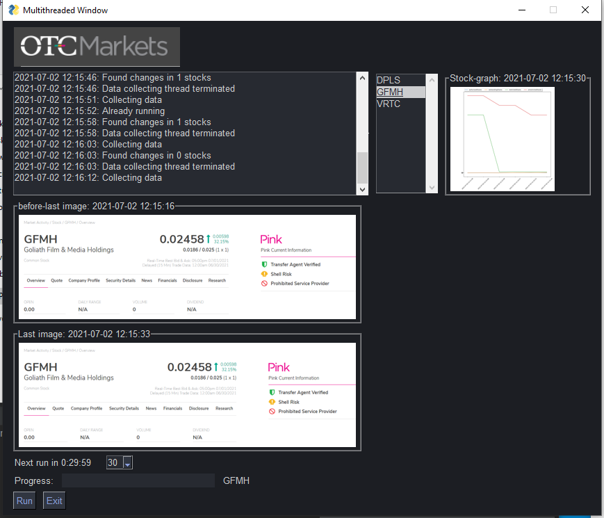

# WebStockScanner
Scan and monitor OCTMarket website for changes in stocks info

# Python requiremtns
- psutil==5.8.0
- tqdm==4.60.0
- selenium==3.141.0
- matplotlib==3.4.2
- pandas==1.2.4
- Pillow==8.3.0
- PySimpleGUI==4.45.0

# Export to .exe

- pip install pyinstaller
- pyinstaller --noconsole --onefile main.py
- main.exe should be in one folder with the following required files

# Required files
- chromedriver.exe: (Download from https://chromedriver.chromium.org/downloads)
- stock_names.csv: stock anem (e.g GMFH) in each line
- plot_fields.csv: stock data fields to monitor by plots
- ignore_fields.csv: stock data fields to ignore

